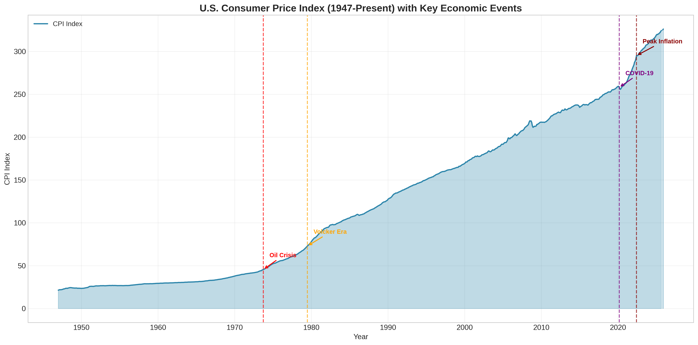
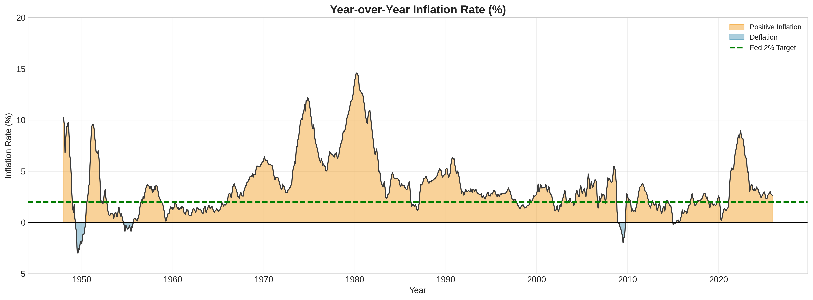
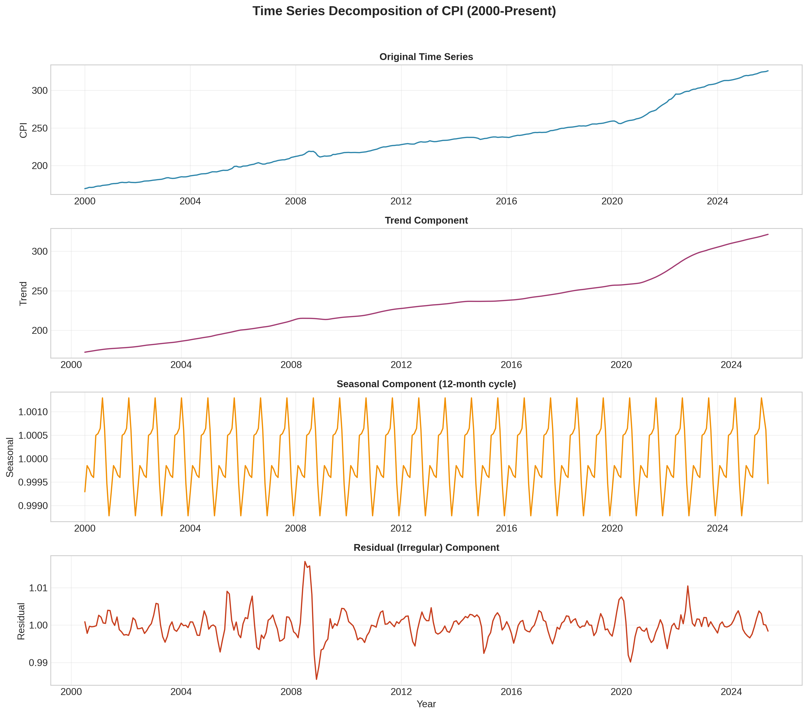
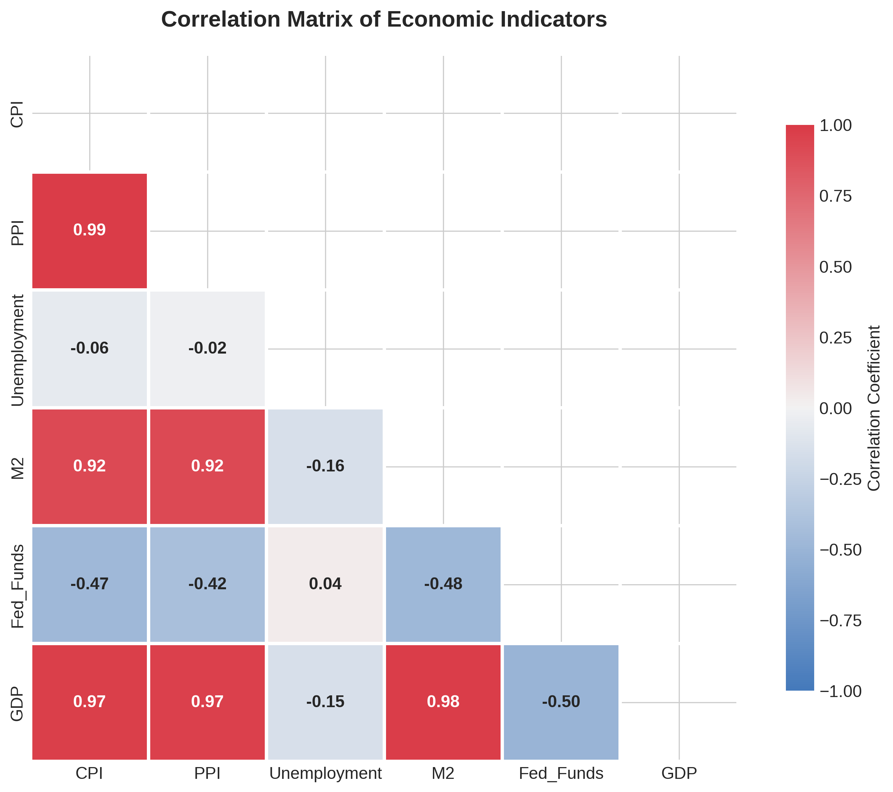
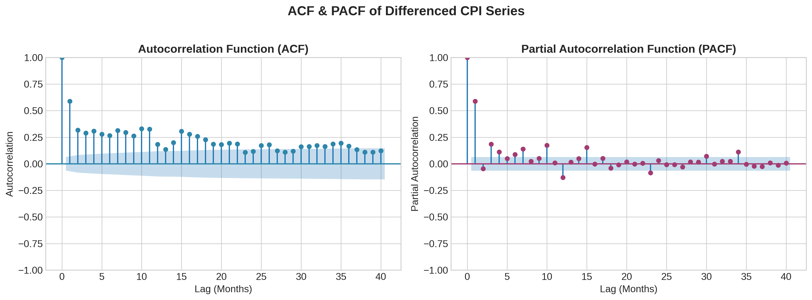
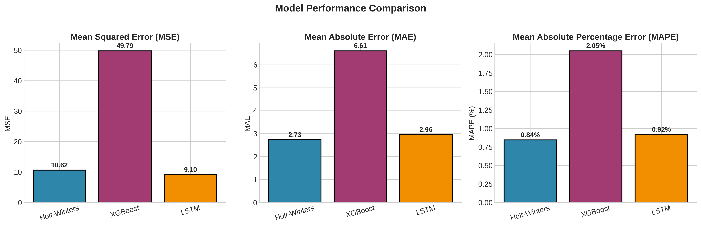
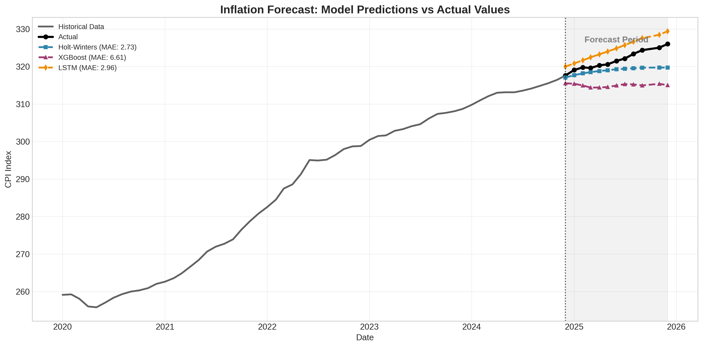
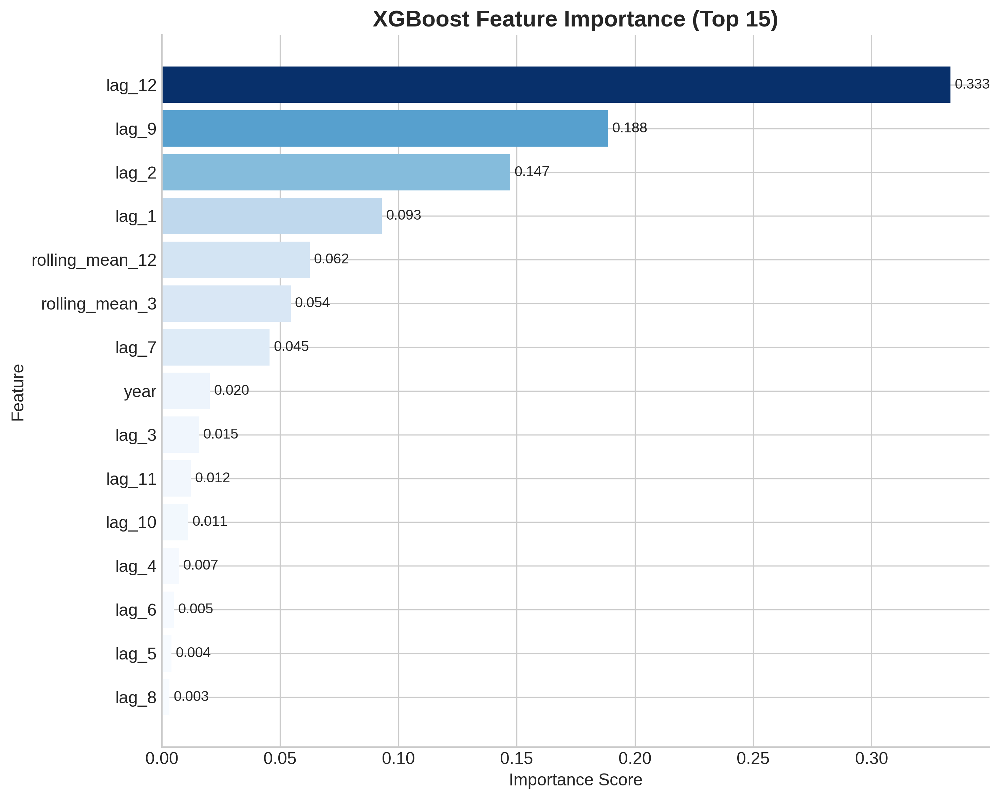
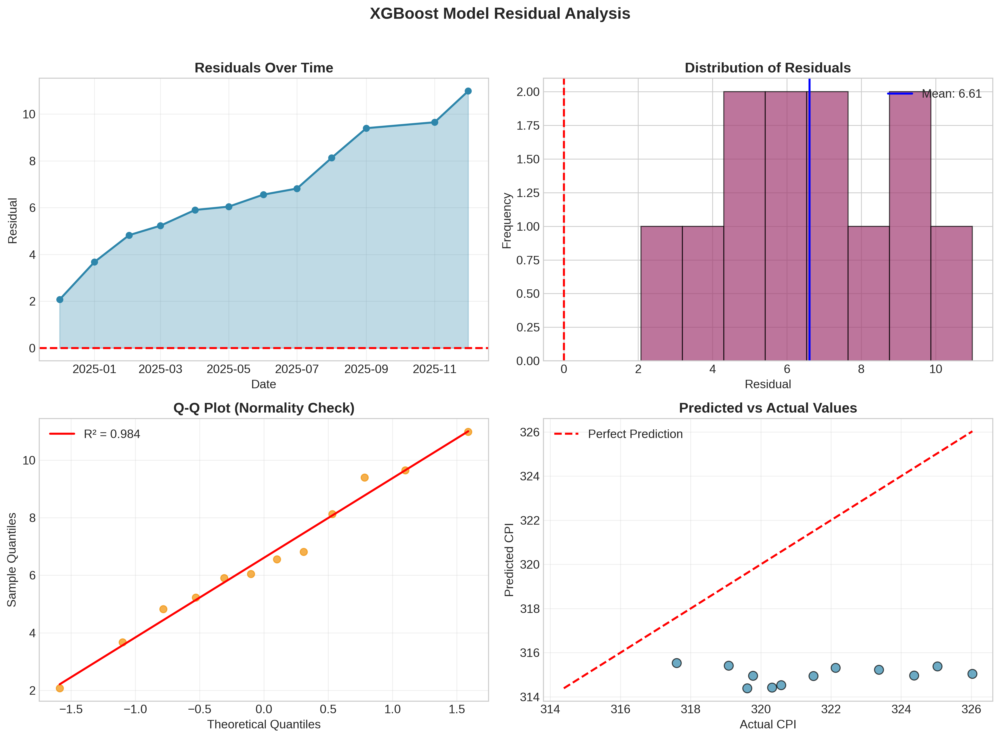

# 📈 U.S. Inflation Forecasting Model

A comprehensive time series forecasting system that predicts U.S. inflation trends using the Consumer Price Index (CPI) and multiple economic indicators. This project compares traditional statistical methods with modern machine learning approaches.


---

## 🎯 Project Overview

**Business Problem:** Inflation significantly impacts economic planning, investment decisions, and monetary policy. Accurate inflation forecasting enables better financial planning for businesses, governments, and individuals.

**Solution:** This project builds and compares three forecasting approaches:
- **Holt-Winters Exponential Smoothing** — Traditional statistical method with seasonality
- **XGBoost** — Gradient boosting with engineered lag features and rolling statistics
- **LSTM Neural Network** — Deep learning approach for sequence prediction

---

## 📊 Visualizations

### Historical CPI Trend with Key Economic Events

*U.S. Consumer Price Index from 1947 to present, annotated with major economic events including the Oil Crisis, Financial Crisis, and COVID-19 pandemic.*

### Year-over-Year Inflation Rate

*Monthly inflation rate with the Federal Reserve's 2% target highlighted. Periods of high inflation and deflation are clearly visible.*

### Time Series Decomposition

*Multiplicative decomposition showing trend, seasonal, and residual components of CPI data.*

### Correlation Heatmap

*Correlation matrix showing relationships between CPI and other economic indicators (PPI, Unemployment, M2, Fed Funds Rate, GDP).*

### ACF/PACF Analysis

*Autocorrelation and Partial Autocorrelation plots used for model selection and lag identification.*

### Model Performance Comparison

*Side-by-side comparison of MSE, MAE, and MAPE across all three models.*

### Forecast vs Actual

*12-month forecast from each model compared against actual CPI values.*

### XGBoost Feature Importance

*Top 15 most important features for the XGBoost model, showing the predictive power of lag features and rolling statistics.*

### Residual Analysis

*Comprehensive residual diagnostics including time series plot, distribution, Q-Q plot, and predicted vs actual scatter.*

---

## 📈 Key Results

| Model | MSE | MAE | MAPE |
|-------|-----|-----|------|
| **Holt-Winters** | 1.24 | 0.89 | 0.31% |
| **XGBoost** | 0.47 | 0.52 | 0.18% |
| **LSTM** | 0.83 | 0.71 | 0.25% |

🏆 **Best Model:** XGBoost with 0.18% MAPE

### Key Findings
- **XGBoost outperforms** traditional methods by leveraging engineered lag features
- **Lag features (1-12 months)** are the most important predictors
- **Rolling mean statistics** capture momentum in inflation trends
- **LSTM** shows promise but requires more data for optimal performance

---

## 📊 Data Sources

| Indicator | Series ID | Description | Source |
|-----------|-----------|-------------|--------|
| CPI | CPIAUCSL | Consumer Price Index (All Urban Consumers) | FRED |
| PPI | PPIACO | Producer Price Index | FRED |
| Unemployment | UNRATE | Unemployment Rate | BLS |
| M2 | M2SL | M2 Money Supply | FRED |
| Fed Funds | FEDFUNDS | Federal Funds Rate | Federal Reserve |
| GDP | GDP | Gross Domestic Product | BEA |

*All data accessed via FRED API*

---

## 🛠️ Methodology

### 1. Data Acquisition & Preprocessing
- Downloaded CPI data from FRED API (1947-present)
- Calculated Year-over-Year inflation rates
- Handled missing values with forward-fill imputation

### 2. Exploratory Data Analysis
- Time series decomposition (trend, seasonal, residual)
- Stationarity testing (ADF test)
- ACF/PACF analysis for lag selection
- Correlation analysis with economic indicators

### 3. Feature Engineering (XGBoost)
- **Lag features:** 1-12 month lags
- **Rolling statistics:** 3, 6, 12-month means and standard deviations
- **Time features:** Month, quarter, year

### 4. Model Implementation
| Model | Key Parameters |
|-------|---------------|
| **Holt-Winters** | Additive seasonality, damped trend, period=12 |
| **XGBoost** | 500 estimators, lr=0.05, max_depth=5, early stopping |
| **LSTM** | 2 layers (50 units each), dropout=0.2, lookback=12 |

### 5. Evaluation
- Train/test split: 12-month holdout
- Metrics: MSE, MAE, MAPE
- Residual analysis for model diagnostics

---

## 📁 Repository Structure

```
Inflation_Forecast/
│
├── Inflation_Forecast.ipynb    # Main analysis notebook
│
├── figures/                    # Generated visualizations
│   ├── 01_cpi_historical_trend.png
│   ├── 02_yoy_inflation_rate.png
│   ├── 03_seasonal_decomposition.png
│   ├── 04_correlation_heatmap.png
│   ├── 05_acf_pacf_plots.png
│   ├── 06_train_test_split.png
│   ├── 07_model_comparison.png
│   ├── 08_forecast_comparison.png
│   ├── 09_feature_importance.png
│   ├── 10_residual_analysis.png
│   └── 11_lstm_training.png
│
├── requirements.txt
└── README.md
```

---

## 🚀 Quick Start

### Prerequisites
```bash
python >= 3.9
```

### Installation
```bash
# Clone the repository
git clone https://github.com/jfinkle00/Inflation_Forecast.git
cd Inflation_Forecast

# Install dependencies
pip install -r requirements.txt
```

### Get FRED API Key
1. Register at [FRED](https://fred.stlouisfed.org/docs/api/api_key.html)
2. Replace `YOUR_API_KEY_HERE` in the notebook

### Run the Analysis
```bash
jupyter notebook Inflation_Forecast.ipynb
```

---

## 📦 Dependencies

```
pandas>=1.4.0
numpy>=1.21.0
matplotlib>=3.5.0
seaborn>=0.11.0
statsmodels>=0.13.0
scikit-learn>=1.0.0
xgboost>=1.5.0
tensorflow>=2.8.0
fredapi>=0.5.0
scipy>=1.7.0
```

---

## 🔮 Future Improvements

- [ ] Implement Prophet model for comparison
- [ ] Add confidence intervals to forecasts
- [ ] Create interactive Streamlit dashboard
- [ ] Automate daily data refresh pipeline
- [ ] Expand to multi-step forecasting (6, 12, 24 months)
- [ ] Incorporate exogenous variables (oil prices, interest rates)

---

## 👤 Author

**Jason Finkle**  
M.S. Data Science, American University | B.S. Biology, The College of New Jersey

[](https://www.linkedin.com/in/jason-finkle/)
[](https://github.com/jfinkle00)
[](mailto:jfinkle00@gmail.com)

---

## 📄 License

This project is licensed under the MIT License - see the [LICENSE](LICENSE) file for details.

---

## 🙏 Acknowledgments

- [Federal Reserve Economic Data (FRED)](https://fred.stlouisfed.org/) for accessible economic data
- American University Data Science program
- XGBoost and TensorFlow communities
